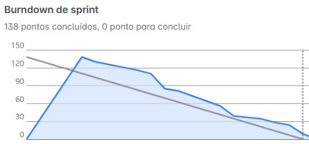

# API 6º Semestre ADS

# DomRock AI - Auxia

# Documentação - Sprint 3

      
      <h2 align="center"> Buzz Tech</h2>

  | <a href ="#desafio"> Desafio</a>  |
  <a href ="#us"> User Stories</a>  |   
  <a href ="#dor">DoR</a>  |
  <a href ="#dod">DoD</a>  |
  <a href ="#burndown">Burndown</a>  | 
  <a href ="#equipe"> Equipe</a> |

> Status da Sprint: Concluído ✅

## 🏅 Desafio 

Implementar o módulo completo de segurança e gestão de usuários da aplicação, garantindo o controle de acesso, autenticação segura, permissões de administrador, e funcionalidades de manutenção como cadastro, edição, listagem, exclusão e redefinição de senhas. Também foi contemplado o login e logout, respeitando perfis de acesso distintos e integrando com o sistema existente.

## 📋 User Stories 

| Rank | Prioridade | User Story                                                                                                                                     | Story Points | Sprint | Requisito do Cliente | Status |
| :--: | :--------: | ---------------------------------------------------------------------------------------------------------------------------------------------- | :----------: | :----: | :------------------: | :----: |
|  11  |   Média    | Como Administrador, eu quero cadastrar novos usuários na plataforma, para que somente pessoas autorizadas possam acessá-la.                    |      17      |   3    |         R06          |   ✅   |
|  12  |   Média    | Como usuário, eu quero acessar a aplicação através de uma interface de login, para que somente usuários autorizados possam utilizar o sistema. |      13      |   3    |         R06          |   ✅   |
|  13  |   Média    | Como usuário autorizado, eu quero acessar o sistema através de um login, para utilizar a aplicação.                                            |      23      |   3    |         R06          |   ✅   |
|  14  |   Média    | Como usuário autenticado, eu quero poder fazer o logout da aplicação de forma segura, para que meus dados não fiquem acessíveis a terceiros.   |      18      |   3    |         R06          |   ✅   |
|  16  |   Média    | Como Administrador, eu quero visualizar a lista de usuários cadastrados, para que eu possa gerenciar quem tem acesso ao sistema.               |      20      |   3    |         R06          |   ✅   |
|  17  |   Média    | Como Administrador, eu quero redefinir a senha de um usuário, para que eu possa ajudá-lo caso ele não consiga acessar a conta.                 |      18      |   3    |         R06          |   ✅   |
|  18  |   Média    | Como Administrador, eu quero excluir usuários do sistema, para que possa revogar o acesso de usuários à aplicação.                             |      13      |   3    |         R06          |   ✅   |
|  24  |   Baixa    | Como usuário, eu quero editar meus dados pessoais, para que eu possa manter minhas informações atualizadas.                                    |      16      |   3    |         R06          |   ✅   |

## 🏅 DoR - Definition of Ready 

| Critério                   | Descrição                                                                                         |
| -------------------------- | ------------------------------------------------------------------------------------------------- |
| Clareza na Descrição       | A User Story está escrita no formato “Como [persona], quero [ação] para que [objetivo]”           |
| Critérios de Aceitação     | A história possui critérios objetivos que indicam o que é necessário para considerá-la concluída. |
| Cenários de Teste          | A história tem pelo menos 1 cenário de teste estruturado (Dado, Quando, Então).                   |
| Independente               | A história pode ser implementada sem depender de outra tarefa da mesma Sprint.                    |
| Referência Visual no Figma | O protótipo correspondente está disponível e vinculado (quando aplicável ao front-end).           |
| Escopo Técnico Validado    | Está claro se a história envolve frontend, backend ou ambos.                                      |
| Perfil de Acesso Definido  | O tipo de usuário (comum ou administrador) está claramente definido para cada história.           |
| Integração com Histórias   | A funcionalidade se conecta logicamente com Sprints anteriores.                                   |
| Estimável                  | A história foi pontuada no Planning Poker ou tem uma estimativa clara.                            |
| Documentos de Apoio        | Há arquivos, links, instruções adicionais quando necessário.                                      |
| Validação com PO           | A história foi discutida com o PO e validada com o time técnico.                                  |

## 🏅 DoD - Definition of Done 

| Critério                           | Descrição                                                                                |
| ---------------------------------- | ---------------------------------------------------------------------------------------- |
| Critérios de Aceitação Atendidos   | Todos os critérios definidos na US foram implementados e validados com sucesso.          |
| Regras de Segurança Aplicadas      | Acesso, autenticação, logout, edição e redefinição de senha seguem padrões de segurança. |
| Dados Persistidos Corretamente     | Alterações (cadastro, edição, exclusão) persistem corretamente no banco de dados.        |
| Comportamento por Perfil Validado  | Testes executados para usuários comuns e administradores.                                |
| Integração com o Sistema Existente | Não há quebra do fluxo existente; funcionalidades se integram ao sistema principal.      |
| Código Revisado                    | A funcionalidade passou por revisão de código entre pares.                               |
| Funcionalidade Integrada           | Foi testada junto com o fluxo completo da aplicação.                                     |
| Documentação Atualizada            | Endpoints, autenticação, permissões e anotações técnicas foram documentadas.             |
| PO Validou Funcionalmente          | O PO testou e aprovou a funcionalidade.                                                  |

## 🏅 Sprint Burndown 

      

## 🎓 Equipe 

  <table>
    <tr>
      <th>Membro</th>
      <th>Função</th>
      <th>Github</th>
      <th>Linkedin</th>
    </tr>
    <tr>
      <td>Ivan Duarte</td>
      <td>Product Owner</td>
      <td></td>
      <td></td>
    </tr>
    <tr>
      <td>Vitor Spricigo Lima</td>
      <td>Scrum Master</td>
      <td></td>
      <td></td>
    </tr>
    <tr>
      <td>Isaque da Silva</td>
      <td>Desenvolvedor</td>
      <td></td>
      <td></td>
    </tr>
    <tr>
      <td>Joice Araujo</td>
      <td>Desenvolvedor</td>
      <td></td>
      <td></td>
    </tr>
    <tr>
      <td>Jonas Alves</td>
      <td>Desenvolvedor</td>
      <td></td>
      <td></td>
    </tr>
    <tr>
      <td>Pedro Davi</td>
      <td>Desenvolvedor</td>
      <td></td>
      <td></td>
    </tr>
    <tr>
      <td>Rafael Motta</td>
      <td>Desenvolvedor</td>
      <td></td>
      <td></td>
    </tr>
  </table>

